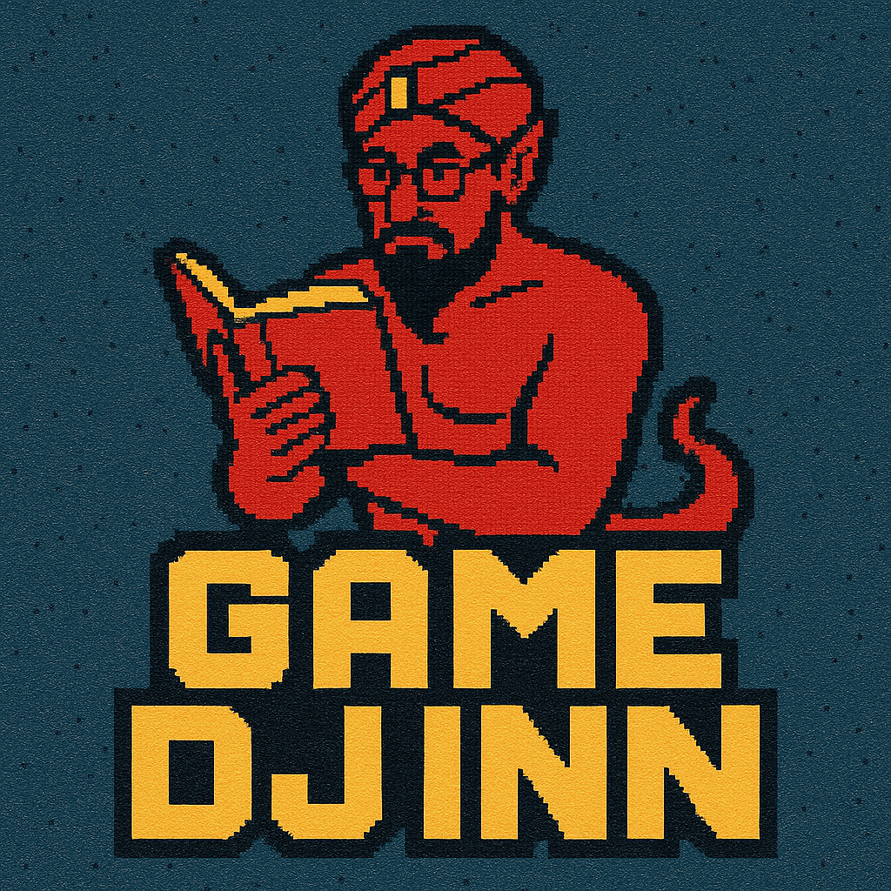

# Game Djinn

<div align="center">
  
</div>

> Your AI-powered gaming companion that knows all your games, across all your platforms

Game Djinn is a self-hosted, platform-agnostic gaming library management system with AI agent integration via the MCP protocol. It unifies your gaming libraries across Steam, Xbox, GOG, and other platforms while providing rich metadata and AI-powered insights.

## Features

- 🎮 **Universal Gaming Library** - Aggregate games from all major platforms
- 🤖 **AI Integration** - Natural language queries via MCP protocol (Claude Desktop compatible)
- 📊 **Rich Metadata** - ESRB ratings, Metacritic scores, and cross-platform insights
- 🏠 **Privacy-Focused** - Self-hosted solution for your homelab
- 🔄 **Automatic Sync** - Keep your libraries up-to-date across platforms

## Quick Start

### Prerequisites

- Docker and Docker Compose
- Python 3.11+
- Node.js 18+
- Make

### Setup

1. Clone the repository:
   ```bash
   git clone https://github.com/jimsantora/game-djinn.git
   cd game-djinn
   ```

2. Copy the environment template:
   ```bash
   cp .env.example .env
   ```

3. Edit `.env` with your API keys:
   - Steam Web API Key (https://steamcommunity.com/dev/apikey)
   - RAWG API Key (https://rawg.io/apidocs)
   - IGDB Client ID & Access Token (https://api.igdb.com/)

4. Run the setup:
   ```bash
   make setup
   make dev
   ```

5. Access the application:
   - Web UI: http://localhost:8000
   - MCP Server: http://localhost:8080

## Project Structure

```
game-djinn/
├── services/
│   ├── web/              # React frontend + FastAPI backend
│   ├── mcp-server/       # MCP protocol server for AI tools
│   ├── ai-service/       # LangChain + Ollama integration
│   └── platform-sync/    # Background sync services
├── database/             # PostgreSQL schemas and migrations
├── scripts/              # Utility scripts
├── docs/                 # Documentation
└── docker-compose.yml    # Development environment
```

## Development

### Available Make Commands

```bash
make setup      # Install dependencies and set up development environment
make dev        # Start all services in development mode
make test       # Run all tests
make lint       # Run linters (ruff, black, eslint)
make build      # Build Docker images
make clean      # Clean up artifacts
make db-migrate # Run database migrations
make db-seed    # Seed test data
```

### Service Endpoints

- **Web Service**: http://localhost:8000
  - REST API documentation: http://localhost:8000/docs
  - WebSocket endpoint: ws://localhost:8000/ws

- **MCP Server**: http://localhost:8080
  - Available tools: game search, library sync, analytics
  - Requires API key authentication

## MCP Integration

Game Djinn exposes gaming tools via the MCP protocol, compatible with:
- Claude Desktop
- Open-WebUI
- Any MCP-compatible client

### Available MCP Tools

- `get_supported_platforms` - List available gaming platforms
- `sync_platform_library` - Sync games from platform APIs
- `search_games` - Universal game search
- `get_game_details` - Comprehensive game information
- `analyze_gaming_patterns` - Gaming insights and analytics
- `recommend_games` - AI-powered recommendations

## Contributing

See [CONTRIBUTING.md](docs/CONTRIBUTING.md) for development guidelines.

## License

This project is licensed under the MIT License - see [LICENSE](LICENSE) for details.

## Acknowledgments

- Built with FastAPI, React, PostgreSQL, and the official MCP Python SDK
- Game data powered by RAWG, IGDB, and platform APIs
- Logo created with AI assistance